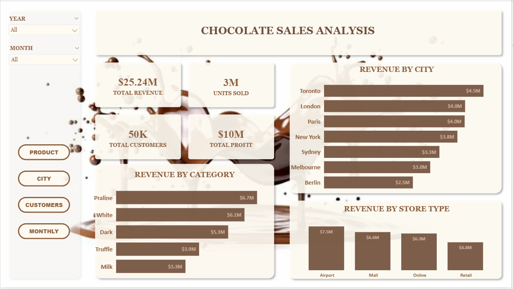
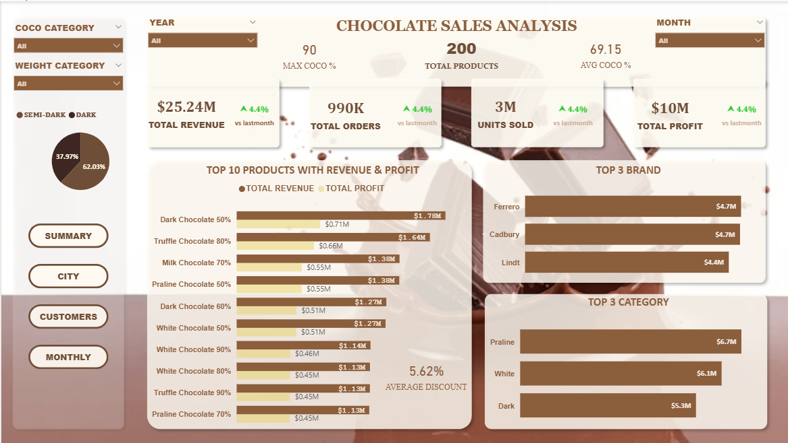
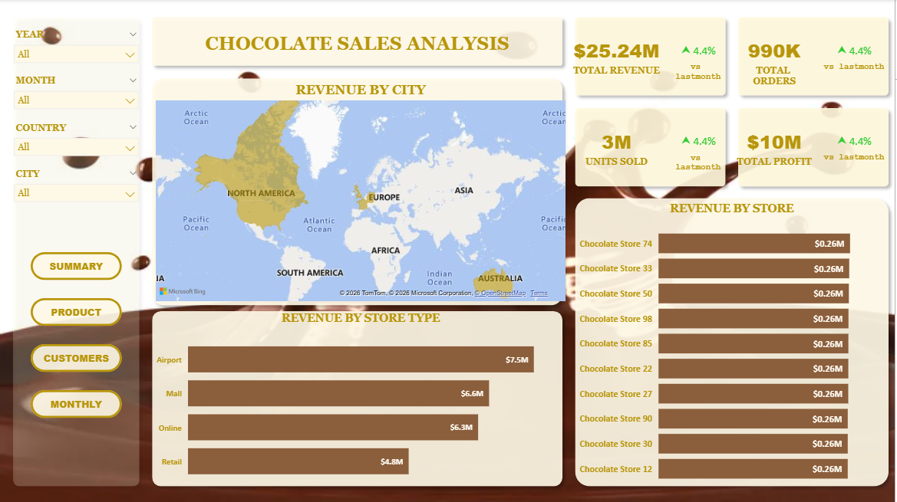
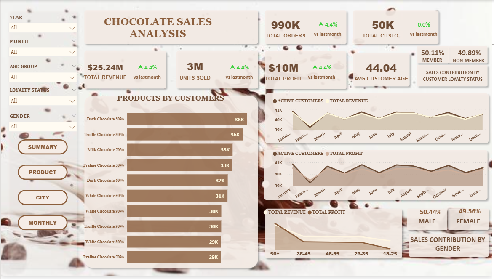
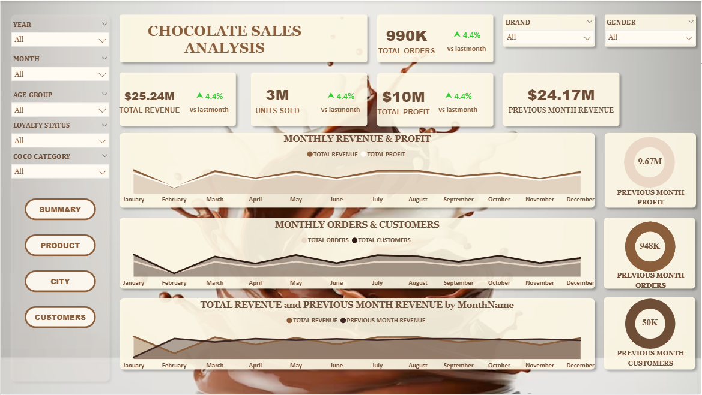

# 🍫 Chocolate Sales Analysis Dashboard (Power BI)

## 📌 Project Overview

This project presents an interactive Chocolate Sales Analysis Dashboard built using Power BI.

It is a multi-page navigation dashboard, allowing users to switch between different analytical views such as product, city, customer, and monthly performance using buttons and bookmarks.

## 🎯 Business Objective

### The dashboard is designed to:

Analyze overall sales, profit, and customer trends

Identify top-performing cities and product categories

Provide interactive navigation between multiple report pages

Enable data-driven decision making

## 🔄 Dashboard Navigation (Power BI)

### This report uses Bookmarks + Buttons to create a navigation experience across pages:

## 🏠 Home / Summary Page

## 📦 Product Analysis

## 🌍 City Analysis

## 👥 Customer Analysis

## 📅 Monthly Trends

Users can click navigation buttons to move between pages seamlessly.

## 📊 Key Performance Indicators (KPIs)

### Metric	Value

Total Revenue	$25.24M
Units Sold	3M
Total Customers	50K
Total Profit	$10M
📈 Key Insights

Toronto is the top revenue-generating city

Praline is the best-selling category

Airport stores contribute the highest revenue

The dashboard provides a complete 360° business view

## 🎛 Features

Multi-page navigation using Bookmarks

Interactive Slicers:

Year

Month

Product

City

Customers

Dynamic visuals and KPIs

## 🛠 Tools & Technologies

Power BI

DAX (Data Analysis Expressions)

Data Modeling

Power Query (Data Cleaning)

Interactive Visualizations

## 📷 Dashboard Pages

### SUMMARY

### PRODUCT 

### CITY

### CUSTOMER

### MONTHLY

